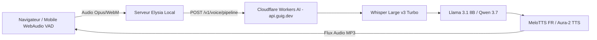

# UltraBlabla • Next-Gen AI Voice Matrix ⚡🎙️

Application de discussion vocale temps réel ultra-rapide, alimentée par **Cloudflare Workers AI (`https://api.guig.dev`)** et **Bun + Elysia**.

---

## ✨ Points Forts & Fonctionnalités Next-Gen

- 🚀 **Démarrage en 1 Clic & Mode Continu (VAD)** : Détection d'activité vocale (Voice Activity Detection) automatique en WebAudio. Vous parlez, l'IA détecte la fin de votre phrase, formule la réponse et la lit à voix haute, puis se remet en écoute sans que vous ayez à recliquer.
- ⚡ **Latence Ultra-Basse** : Pipeline ASR Whisper Large v3 Turbo + Llama 3.1 8B Instruct Fast + MeloTTS FR / Aura-2.
- 🔊 **Voix Françaises Natives & Multilingues** :
  - **Français** : `fr-female-1`, `fr-male-1` (MeloTTS Natif).
  - **Anglais** : `en-female-1` (Deepgram Asteria), `en-male-1` (Orpheus).
  - **Espagnol** : `es-female-1` (Deepgram Celeste).
  - **Premium HD** : `premium-1` (Minimax Speech 2.8 Turbo avec contrôle émotionnel).
- 🛑 **Barge-in / Interruption Instantanée** : Touchez l'écran ou appuyez sur Espace pour interrompre l'IA pendant qu'elle parle et reprendre la parole.
- 🎨 **Interface Holographique Réactive 60 FPS** :
  - Visualiseur d'ondes quantiques Canvas synchronisé en temps réel avec les fréquences de votre voix et de la voix de l'IA.
  - Sélecteur de Persona (Concis & Rapide, Pote Décontracté, Expert Coder).
  - Suggestions de démarrage rapide (chips interactifs).
  - Mode hybride Texte / Voix.

---

## 🛠️ Architecture & Endpoints (`api.guig.dev`)



### Endpoints exposés par le serveur local (`localhost:3000`) :
1. `GET /api/config` : Statut et informations du moteur vocal.
2. `POST /api/voice/pipeline` : Pipeline E2E One-shot (STT $\rightarrow$ LLM $\rightarrow$ TTS).
3. `POST /api/voice/transcribe` : Transcription audio via Whisper v3 Turbo.
4. `POST /api/voice/speak` : Synthèse vocale haute fidélité.
5. `GET /api/voice/voices` : Liste dynamique des voix disponibles.
6. `POST /api/chat` : Complétion textuelle et streaming.

---

## 🚀 Démarrage & Développement

### 1. Installation des dépendances
```bash
bun install
```

### 2. Compilation du bundle client
```bash
bun run build
```

### 3. Lancement du serveur
```bash
bun run dev
```
Ouvrez votre navigateur sur **`http://localhost:3000`**.

### 4. Build Mobile Android (Capacitor)
```bash
bun run android:sync
bun run android:open
```

---

*UltraBlabla 2030 • Conçu pour une expérience conversationnelle vocale fluide et instantanée.*
